# PaperCanvas

**Okumadan önce, anlamak için.**

PaperCanvas, akademik makaleleri ve araştırma dokümanlarını (Matematik, Makine Öğrenmesi, Yapay Zeka ve Veri Bilimi odaklı) otomatik olarak analiz eden, ortak yapıları ayrıştıran, matematiksel formülleri LaTeX formatına çeviren ve sonsuz bir görsel tuval üzerinde ekipçe sentezlemenizi sağlayan yeni nesil bir ArGe araştırma atlasıdır.

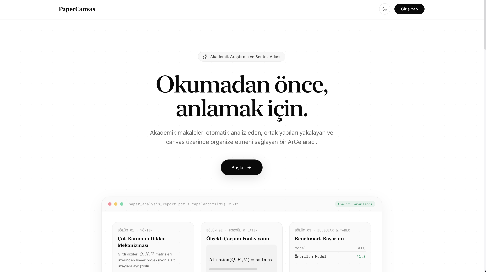

---

## Neden Bu Araç Var?

Aynı formatta düzinelerce akademik makale okumak araştırmacılar için ciddi bir zaman maliyeti yaratır. Her seferinde yöntemi, veri setini, deneysel bulguları ve formülleri manuel olarak bulup çıkarmak gerekir.

PaperCanvas makaleyi arka planda analiz ederek kendi anlatı akışına göre mantıksal bloklara böler ve ortak araştırma desenlerini (yöntem, deney, teorem, karşılaştırma) otomatik yakalar. 

Sonuç olarak: Makalenin kendi görselleri, tabloları, matematiksel notasyonu ve öne çıkan anahtar bulgularıyla birlikte düzenli, taranabilir ve görselleştirilmiş bir çalışma alanına dönüştürülür.

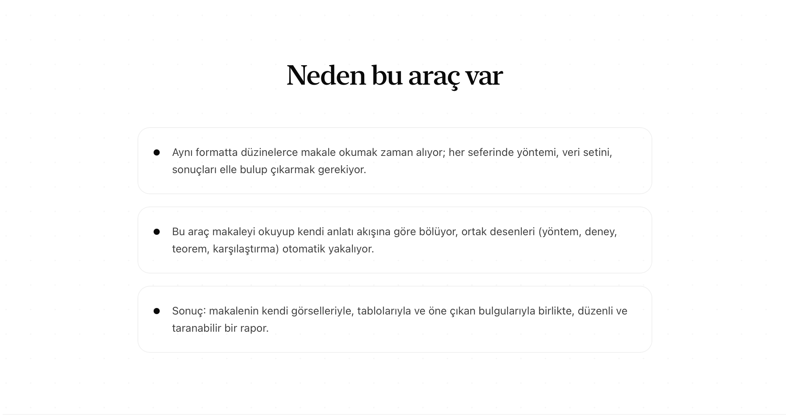

---

## Nasıl Çalışır?

| Adım | Başlık | Açıklama |
|---|---|---|
| 01 | Makaleni Yükle | PDF dosyasını sürükleyip bırakın, asenkron analiz kuyruğu otomatik başlasın. |
| 02 | Otomatik Analiz | Yöntem, bulgular, matematiksel formüller, görsel ve tablolar tespit edilir. |
| 03 | Planla ve Onayla | Rapora hangi bölümlerin gireceğine, sırasına ve diyagramlara karar verin. |
| 04 | Canvas'ta Organize Et | Bölümleri ve dokümanları tuvale sürükleyin, notlar ekleyin ve ilişkiler kurun. |

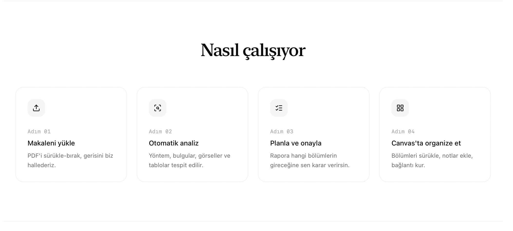

---

## Disiplin Bazlı Modelleme

PaperCanvas, farklı bilimsel disiplinlerin kendine has makale yapılarına göre özelleşmiş analiz ve gösterim kuralları sunar:

### 1. Matematik ve Kuramsal Temeller
- Teorem, lemma ve ispat hiyerarşisini otomatik ayrıştırır.
- Matematiksel notasyonu ve denklemleri LaTeX formatında eksiksiz yakalar.
- Notasyonel tutarlılığı doğrular.

### 2. Makine Öğrenmesi ve Algoritmalar
- Yapay sinir ağı mimarilerini ve hiperparametre tablolarını çıkarır.
- Ablasyon çalışmalarını karşılaştırmalı özet tablolarına dönüştürür.
- Metrik kıyaslama analizleri üretir.

### 3. Yapay Zeka Sistemleri
- Sistem mimarilerini, veri akış şemalarını ve deneysel sonuçları modüler bloklara böler.
- Her alt bileşeni bağımsız olarak taranabilir ve sorgulanabilir kılar.
- Karar ağacı ve akış modellerini yapılandırır.

### 4. Veri Bilimi ve İstatistik
- Veri seti dağılımlarını ve ön işleme adımlarını modeller.
- İstatistiksel değerlendirme metriklerini tablolara dönüştürür.
- Sayısal sonuç ve kıyaslama özetleri sunar.

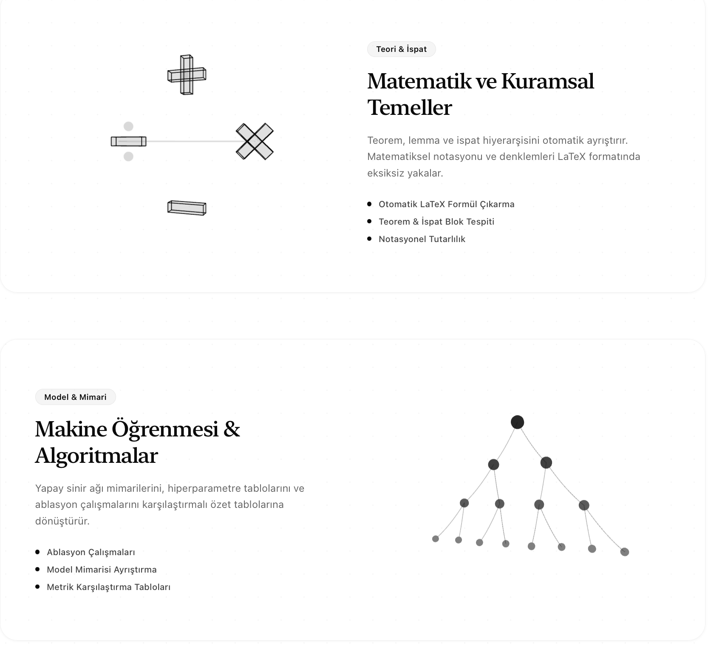

---

## Ekran Görüntüleri ve Arayüz Galerisi

### 1. Giriş ve Kimlik Doğrulama
Supabase JWT entegrasyonu ile güvenli, oturum bazlı çalışma alanı izolasyonu.

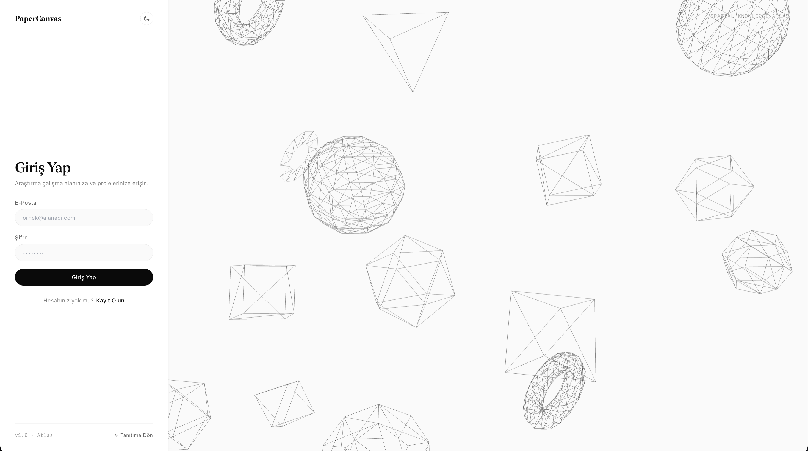

### 2. Projeler ve Araştırma Alanları
Çok kullanıcılı ekip çalışma alanları, rol bazlı yetkilendirme ve üye yönetimi.

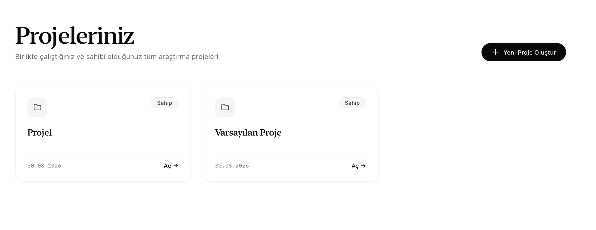

### 3. Doküman Envanteri ve Yükleme
PDF yükleme, arka plan işlem durumu takibi ve ortak doküman kütüphanesi.

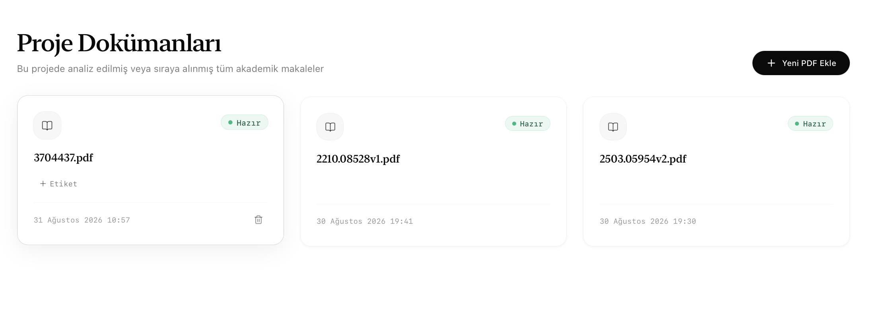

### 4. Yapılandırılmış Rapor ve LaTeX Görünümü
Docling ayrıştırması, KaTeX matematiksel dizgisi ve etkileşimli içerik kartları.

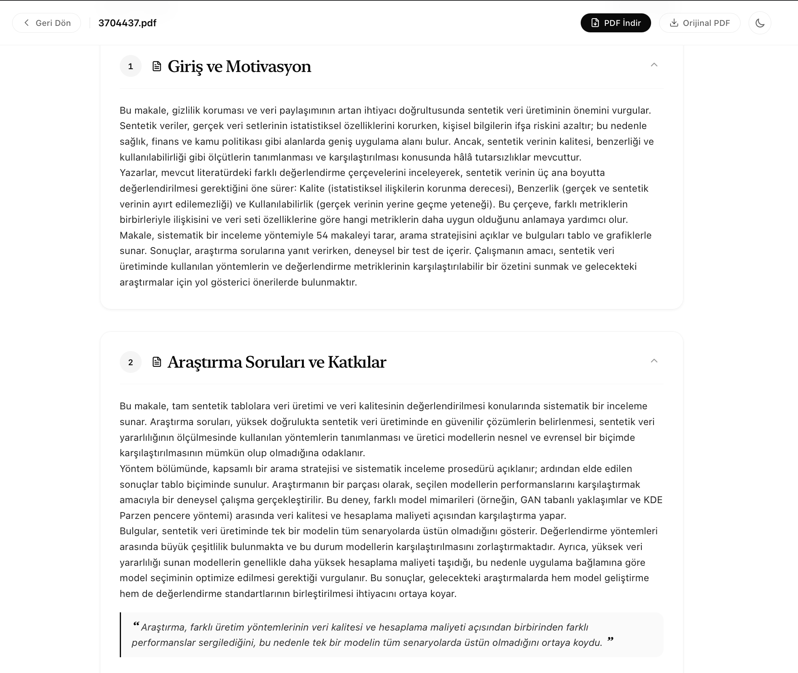
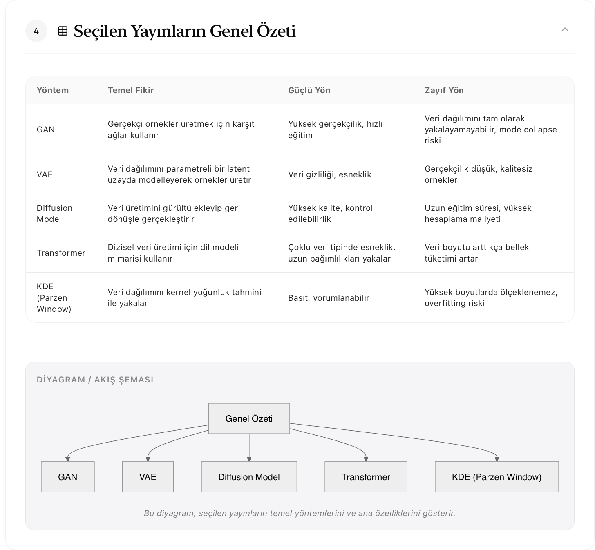
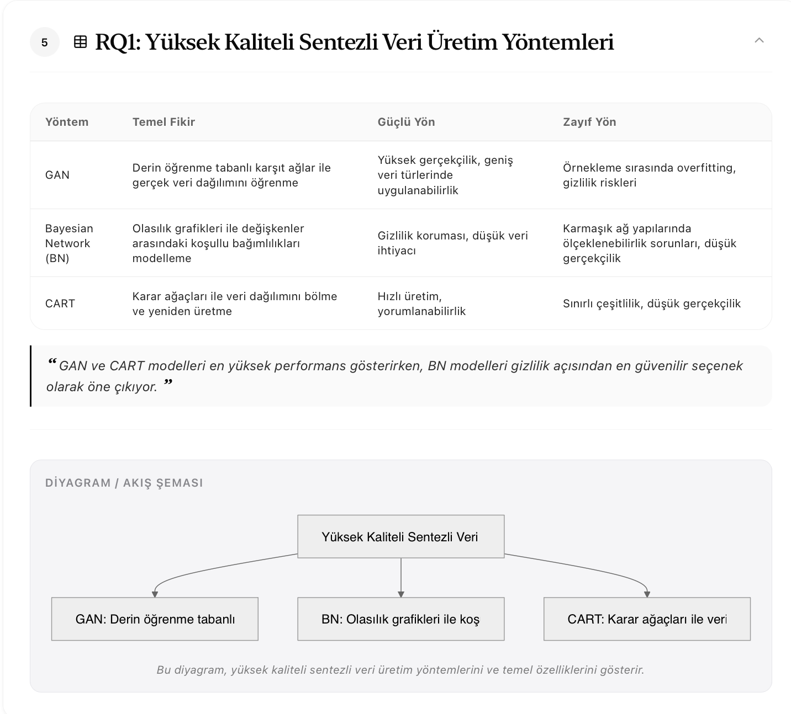
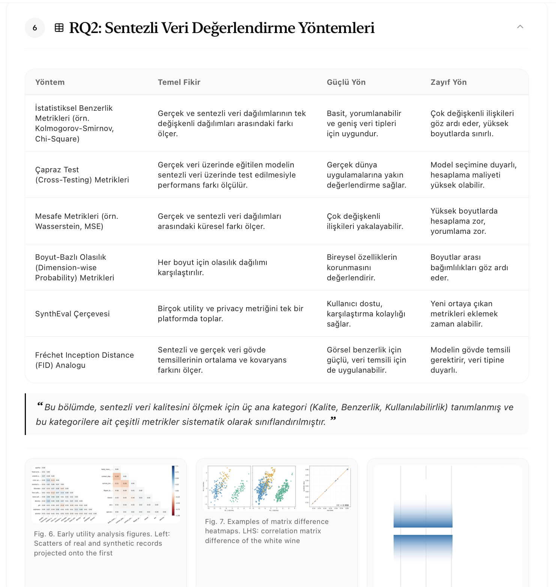

### 5. RAG Destekli Araştırma Asistanı (Chatbot)
Vektör indeksli doküman üzerinde kaynak sayfa referanslı, halüsinasyon korumalı soru-cevap.

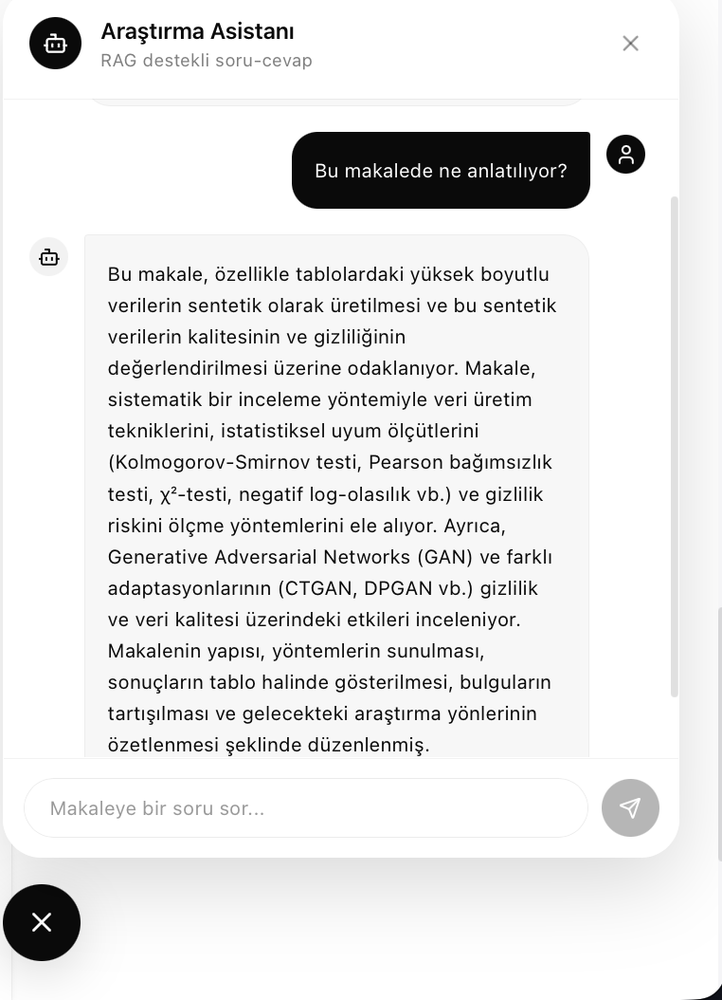

### 6. Sonsuz Canvas Çalışma Alanı
React Flow tabanlı, doküman kutucukları, rapor bölümleri, notlar ve yönlü ilişkiler içeren görsel sentez tuvali.

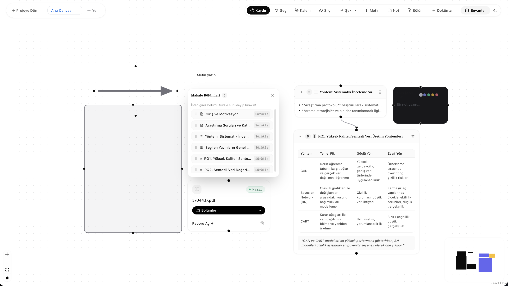

---

## Proje Geliştirme Adımları ve Fazlar

<details>
<summary><b>Faz 1: Analiz Motoru ve Web Arayüzü (Adım 1 - 9)</b></summary>

- **Adım 1 - Docling Parser:** PDF dokümanlarını layout-aware olarak ayrıştırarak bölümler (sections), başlık seviyeleri, sayfa aralıkları ve matematiksel formülleri yapılandırılmış JSON çıktısına dönüştürür.
- **Adım 2 - PaperProfile Sınıflandırıcısı:** Düşük token maliyetiyle doküman iskeletini tek seferlik LLM çağrısıyla analiz ederek 17 bağımsız içerik bayrağı, birincil araştırma alanı (primary_domain) ve güven skoru çıkarır.
- **Adım 3 - Section Routing ve ChromaDB:** PaperProfile bayraklarına göre makale için üretilecek aktif rapor bölüm gruplarını belirler ve bölüm sınırlarını koruyarak dokümanı yerel ChromaDB vektör uzayına indeksler.
- **Adım 4 - Slot Doldurma ve Rapor Üretimi:** Her aktif bölüm grubu için ChromaDB'den semantik parçaları çeker ve structured output ile tipine uygun (prose, table, list) zengin rapor içeriğini kaynak sayfa referanslarıyla üretir.
- **Adım 5 - Kontrol Paneli Çekmecesi:** Kullanıcının hangi bölümleri rapora dahil edeceğini, bölüm sırasını ve hangi bölümler için diyagram üretileceğini belirleyip nihai raporu finalize etmesini sağlar.
- **Adım 6 - Deterministik Diyagram Üretimi:** LLM sadece graf JSON spesifikasyonu (nodes ve edges) üretir; Mermaid.js koduna çevrim deterministik olarak kod tarafında yapılır.
- **Adım 7 - Makale Chatbotu (RAG):** İndekslenmiş doküman üzerinde ChromaDB RAG ile kaynak sayfa referanslı serbest soru-cevap asistanı sunar.
- **Adım 8 - Formül Çıkarımı ve LaTeX:** Docling ham formül bloklarını LaTeX formatına dönüştürür; matematiksel yoğunluk tespitinde rapor bölümlerini formüllerle zenginleştirir.
- **Adım 9 - Web Arayüzü:** React, Vite, KaTeX formül görüntüleme, Mermaid akış diyagramları, sürükle-bırak çekmece ve sağ altta yüzen chatbot arayüzü sunar.

</details>

<details>
<summary><b>Faz 2: Kalıcılık, Veri ve Asenkron İşlem Katmanı (Adım 10 - 13)</b></summary>

- **Adım 10 - PostgreSQL Şeması ve MinIO Depolama:** SQLAlchemy 2.0 Async, asyncpg ve Alembic ile ORM modelleri (User, Project, Document, Report, Section, Note, Tag) ve MinIO S3-uyumlu obje depolama altyapısı kuruldu.
- **Adım 11 - Pipeline DB ve Obje Depolama Entegrasyonu:** PDF yüklemelerinin MinIO'ya ve analiz sonuçlarının PostgreSQL'e kaydedildiği kalıcı boru hattı; geçmiş dokümanları ve raporları yeniden LLM çalıştırmadan getiren REST API katmanı oluşturuldu.
- **Adım 12 - Asenkron İşlem Mimarisi (Celery & Redis):** Celery ve Redis tabanlı kuyruk yapısı; anında cevap dönen doküman yükleme, durum yoklama (polling) ve arka plan hata yönetimi sağlandı.
- **Adım 13 - Asenkron Akış ve Proje Doküman Listesi:** Projedeki tüm dokümanları listeleyen pano görünümü, gerçek zamanlı durum takibi ve işlenen raporlara kesintisiz geçiş bağlandı.

</details>

<details>
<summary><b>Faz 3: Görsel Canvas Çalışma Alanı (Adım 14 - 16)</b></summary>

- **Adım 14 - Canvas Temel Kurulumu:** React Flow entegrasyonu, canvases ve canvas_items PostgreSQL tabloları, sürükle-bırak pozisyon koordinat kaydı ve doküman kutucuğu düğümleri (DocumentBoxNode) inşa edildi.
- **Adım 15 - Canvas Bağlantı ve Not Sistemi:** Doküman kutucukları, rapor bölümleri ve notlar arası yönlü ok bağlantıları, etiket düzenleme, yeniden boyutlandırılabilir serbest not düğümleri (NoteNode) ve içerik senkronizasyonu sağlandı.
- **Adım 16 - Çoklu Canvas Sekmeleri ve Envanter Paneli:** Proje içinde bağımsız birden çok canvas sekmesi (CanvasTabs), envanter çekmecesi ve envanterden tuvale sürükle-bırak yerleştirme tamamlandı.

</details>

<details>
<summary><b>Faz 4: Çoklu Kullanıcı, Yetkilendirme ve Ortak Envanter (Adım 17 - 19)</b></summary>

- **Adım 17 - Supabase Auth Entegrasyonu:** Supabase JWT doğrulaması, FastAPI dependency injection, JIT kullanıcı provizyonu ve kullanıcıya özel proje/doküman izolasyonu eklendi.
- **Adım 18 - Yetkilendirme Modeli ve Proje Davet Sistemi:** ProjectMember ve ProjectInvite tabloları, rol hiyerarşisi (viewer, editor, owner), güvenli token tabanlı davet bağlantıları ve üye yönetim paneli kuruldu.
- **Adım 19 - Ortak Envanter Katkı İzleme:** Envanter ve canvas elemanlarında takım üyesi katkı rozeti gösterimi ve mevcut dokümanları çoğaltmadan diğer projelere bağlama akışı tamamlandı.

</details>

---

## Mimari ve Teknoloji Yığını

| Katman | Teknolojiler |
|---|---|
| Frontend | React 18, TypeScript, Vite, Tailwind CSS, React Flow, Three.js, React Three Fiber, React Three Drei, KaTeX, Framer Motion, Lucide Icons |
| Backend API | Python 3.11+, FastAPI, Pydantic v2, SQLAlchemy 2.0 (Async), Alembic |
| Asenkron Görevler | Celery, Redis |
| Veritabanı & Vektör | PostgreSQL 16, ChromaDB (Yerel Vektör Uzayı) |
| Obje Depolama | MinIO (S3 Uyumlu) |
| Kimlik Doğrulama | Supabase Auth (JWT) |
| Doküman Ayrıştırma | Docling Parser, Nougat |
| LLM & Çıkarım | Groq API (openai/gpt-oss-20b) |

---

## Kurulum ve Çalıştırma

### Yöntem 1: Docker Compose ile Çalıştırma (Önerilen)

Tüm servisleri (PostgreSQL, MinIO, Redis, FastAPI Backend, Celery Worker ve React Frontend) tek komutla başlatabilirsiniz:

```bash
# 1. Ortam değişkenlerini yapılandırın
cp .env.example .env
# .env dosyasındaki GROQ_API_KEY ve Supabase anahtarlarını doldurun

# 2. Tüm servisleri container içinde başlatın
docker compose up -d

# 3. Veritabanı tablolarını en son migration seviyesine güncelleyin
docker compose exec backend alembic upgrade head
```

Erişim Noktaları:
- Web Arayüzü: `http://localhost:5173`
- Backend Swagger API Belgeleri: `http://localhost:8000/docs`
- MinIO Yönetim Paneli: `http://localhost:9001` (Kullanıcı: `devadmin`, Şifre: `devpassword123`)

---

### Yöntem 2: Manuel Geliştirme Ortamı

#### 1. Altyapı Servislerini Başlatma
```bash
docker compose up -d postgres minio redis
```

#### 2. Backend & Celery Kurulumu
```bash
python3 -m venv .venv
source .venv/bin/activate
pip install -r requirements.txt
alembic upgrade head

# Terminal 1 - API Sunucusu:
uvicorn app.main:app --reload --port 8000

# Terminal 2 - Asenkron İşçi (Celery):
celery -A app.worker.celery_app worker --loglevel=info
```

#### 3. Frontend Kurulumu
```bash
cd frontend
npm install

# Terminal 3 - Geliştirme Sunucusu:
npm run dev
```

---

## Test ve Doğrulama

Sistem testlerini çalıştırmak için:

```bash
# Backend birim ve entegrasyon testleri
.venv/bin/pytest tests/

# Frontend tip ve derleme testi
cd frontend && npm run build
```

---

## Proje Dizin Yapısı

```text
rnd-research-atlas/
├── app/
│   ├── auth/            # Supabase JWT doğrulama ve yetkilendirme
│   ├── config/          # Ortam ayarları ve sabitler
│   ├── db/              # SQLAlchemy modelleri, repository ve oturum
│   ├── models/          # Pydantic veri şemaları
│   ├── parsers/         # Docling PDF ayrıştırıcı
│   ├── routers/         # FastAPI REST API endpointleri
│   ├── services/        # Sınıflandırıcı, formül çıkarıcı, RAG ve slot filling
│   ├── storage/         # MinIO obje depolama istemcisi
│   └── worker/          # Celery asenkron görev tanımları
├── frontend/
│   ├── src/
│   │   ├── api/         # Backend API istemcisi
│   │   ├── auth/        # React Auth Context ve kancaları
│   │   ├── components/  # 3D canvas, KaTeX, Flow Node ve UI bileşenleri
│   │   ├── pages/       # Landing, Login, Projects, Canvas, Report sayfaları
│   │   └── theme/       # Açık/koyu tema sağlayıcısı
├── screenshots/         # Dokümantasyon ekran görüntüleri
├── tests/               # Pytest test suitleri
├── docker-compose.yml   # Çoklu servis orkestrasyonu
└── README.md            # Kapsamlı proje dokümantasyonu
```

---

## Lisans ve İletişim

PaperCanvas, akademik ve kurumsal araştırma süreçlerini hızlandırmak amacıyla açık mimari standartlarıyla geliştirilmiştir.

- GitHub: [github.com/erenosma2626-dot/rnd-research-atlas](https://github.com/erenosma2626-dot/rnd-research-atlas)
- Telif Hakkı: (c) 2026 PaperCanvas. Tüm hakları saklıdır.
